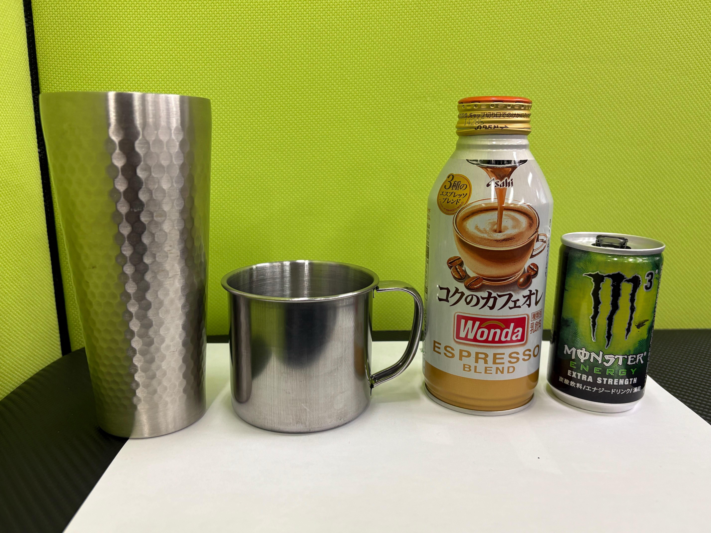
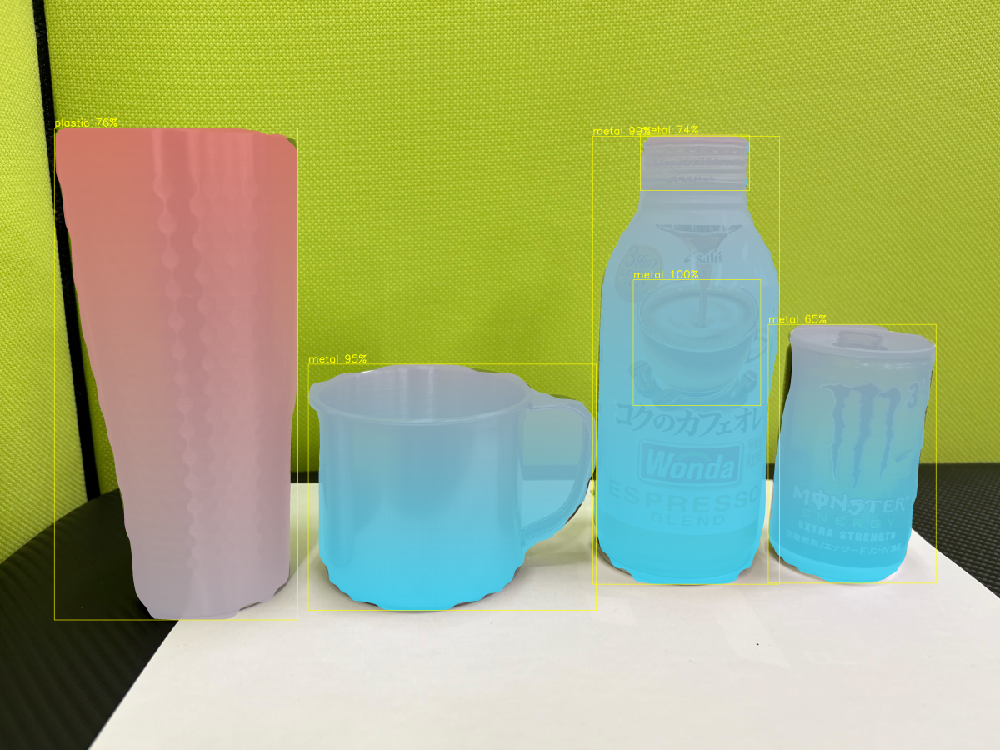

# Deformability Visualization

物体の変形特性を可視化するシステム

## Overview

本システムでは，ロボットハンドによる把持時に得られる把持力 **F** と
対象物の変位 **dx** の関係から等価剛性

k = F / dx

を算出し，その空間分布をカラーマップとして可視化しています．

- 🔵 青：剛性が高い領域（変形しにくい）
- 🔴 赤：剛性が低い領域（変形しやすい）

## Visualization Example

| Input Image | Deformation Map |
|-------------|----------------|
|  |  |
